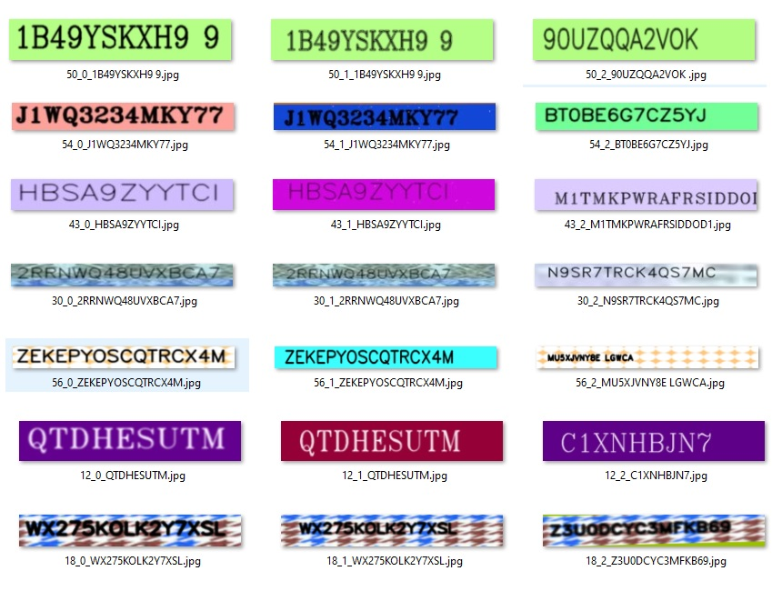

# Synthetic Text Images Generator
Generate image triplets [anchor, positive, negative] with random text to train a triplet loss function for different purposes:
- Text Recognition
- Text Similarity from images

note that text in anchor & positive is same while it's different in the negative.

## Requirements  
- pip install opencv-python
- image augmentor https://github.com/aleju/imgaug, pip install imgaug

## things to do/add:
I am planning to add:
- generate text from file. (currently only random text)
- more image augmentation options
- support other languages other than english (currently opencv support only English, will use different library to write text on image)
- exposue all thresholds in a config file with a documentation for each of them